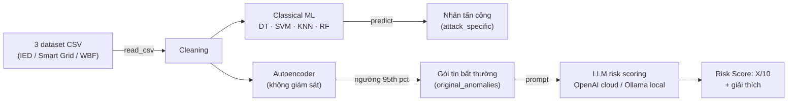

# Modbus ICS-IDS — Autoencoder + LLM Risk Scoring

Intrusion Detection System (IDS) cho hệ thống điều khiển công nghiệp (ICS) mô phỏng bằng [Curtin ICS-SimLab](https://github.com/JaxsonBrownie/ICS-SimLab), phát hiện bất thường trên gói tin Modbus/TCP bằng autoencoder, phân loại kiểu tấn công bằng ML cổ điển, và chấm điểm rủi ro bằng LLM (OpenAI cloud hoặc model local qua Ollama).

Toàn bộ pipeline nằm trong [`ics_simlab_sanh.ipynb`](ics_simlab_sanh.ipynb). File này hướng dẫn cách chạy nó từ đầu.

## Mục lục

- [Tổng quan pipeline](#tổng-quan-pipeline)
- [Yêu cầu trước khi chạy](#yêu-cầu-trước-khi-chạy)
- [Thứ tự chạy cell](#thứ-tự-chạy-cell)
- [File có sẵn trong repo](#file-có-sẵn-trong-repo)
- [Các vấn đề đã gặp & cách xử lý](#các-vấn-đề-đã-gặp--cách-xử-lý)
- [Nhật ký thực nghiệm](#nhật-ký-thực-nghiệm)
- [So sánh kiến trúc autoencoder: Linear vs LSTM vs VAE](#so-sánh-kiến-trúc-autoencoder-linear-vs-lstm-vs-vae)

## Tổng quan pipeline

`Cleaning` tạo ra một dataset dùng chung cho **hai nhánh độc lập**:

- **Classical ML** (Decision Tree, SVM, KNN, Random Forest) — chỉ phân loại kiểu tấn công, không liên quan tới LLM.
- **Autoencoder** — phát hiện bất thường không giám sát, gói tin bất thường mới được đưa tiếp vào LLM để chấm risk score.

## Yêu cầu trước khi chạy

| Thành phần | Ghi chú |
|---|---|
| Python venv | Cần `pandas`, `numpy`, `scikit-learn`, `torch`, `matplotlib`, `requests`, `scipy`, `openai`, `kaggle`. Chọn đúng kernel này trong VS Code/Jupyter trước khi chạy. |
| Dữ liệu | Notebook đọc dataset từ đường dẫn cố định trong biến `DATA_DIR` (cell "Load Datasets", "Download Dataset (Kaggle)", "Cleaning"). **Đổi lại đường dẫn này cho khớp máy bạn** trước khi chạy — mặc định đang trỏ tới máy phát triển gốc. Cần 3 file: `dataset_ied_packetv4.csv`, `dataset_sg_packetv4.csv`, `dataset_wbf_packetv4.csv`. |
| Model weight có sẵn | Repo này đã kèm sẵn các file `.pt`/`.pkl` đã train (xem [File có sẵn trong repo](#file-có-sẵn-trong-repo)) — không bắt buộc chạy lại cell "Load Models"/"Download Dataset". |
| `OPENAI_API_KEY` | Chỉ cần nếu chạy pipeline LLM cloud (cell "Complete Pipeline"). Tốn phí — xem cảnh báo bên dưới. |
| Ollama | Chỉ cần nếu chạy so sánh LLM local (cell "Local LLM Comparison"). Cần `ollama serve` đang chạy và đã `ollama pull` các model muốn test. |

> Máy không có GPU vẫn chạy được bình thường trên CPU — `torch.cuda.is_available()` trả `False` là chuyện thường, không phải lỗi. Autoencoder và các model Ollama chỉ chậm hơn, không hỏng.

## Thứ tự chạy cell

Notebook chia theo section, chạy tuần tự từ trên xuống:

1. **Datasets** — `Load Datasets` (bắt buộc) → `Download Dataset (Kaggle)` (tuỳ chọn, chỉ khi chưa có data) → `Load Models` (tuỳ chọn, tải sẵn weight từ GitHub gốc — 3 file RF sẽ luôn báo 404 vì repo gốc không có bản `v4` cho RF, không sao vì cell RF bên dưới tự train lại).
2. **Data Processing** — `Cleaning` (bắt buộc) → `Data Splitting` (bắt buộc trước phần ML).
3. **Visualisation** — tuỳ chọn, chỉ để xem thống kê/t-SNE.
4. **Classical ML** — `DT`, `SVM`, `KNN`, `RF`: 4 cell độc lập, tự train + đánh giá + test chéo giữa 3 dataset.
5. **Deep Learning** — `AutoEncoder` (mặc định load lại weight có sẵn, không train lại) và `AutoEncoder_Test` (biến thể latent nhỏ hơn, mặc định tự train lại từ đầu).
6. **Intrusion Detection Pipeline** — 2 cell "Complete Pipeline" giống nhau, chỉ khác model (`o4-mini` cũ và `gpt-5.6-luna` mới hơn — nên chạy bản mới). Cần `OPENAI_API_KEY`. **Cell này định nghĩa các biến/hàm dùng chung cho bước 7** (`attacks`, `original_anomalies`, `df_orig`, `select_anomalous_packet`, `extract_packet_info`, `create_prompt`) — phải chạy ít nhất 1 trong 2 cell này trước, kể cả khi không dùng OpenAI.
7. **So sánh Local LLM (Ollama)** — thay OpenAI bằng model local, miễn phí nhưng chậm hơn nhiều trên CPU. Mặc định 4 model × 8 loại tấn công × 3 lần lặp = 96 lần gọi.
8. **Random Stuff** (cuối notebook) — các cell scratch vẽ timeline, phụ thuộc biến từ bước 6, không cần thiết cho pipeline chính.

## File có sẵn trong repo

| File | Sinh ra từ |
|---|---|
| `*_ae_model.pt` | Autoencoder đã train (Deep Learning) |
| `*_dt_model.pkl`, `*_knn_model.pkl` | Model ML cổ điển đã train |
| `*_threshold.txt` | Ngưỡng reconstruction error (95th percentile) của autoencoder |
| `local_llm_comparison_results.csv` | Chi tiết từng lần gọi model local qua Ollama |
| `local_llm_comparison_summary.csv` | Bảng so sánh tốc độ / độ ổn định / độ tuân thủ format giữa các model |
| `local llms.py` | Bản script độc lập tương đương cell "Local LLM Comparison", chạy được ngoài notebook nếu đã có sẵn các biến cần thiết trong kernel |

## Các vấn đề đã gặp & cách xử lý

Ghi lại để đỡ mất công debug lại từ đầu:

- **`Request timed out.` khi gọi model Ollama** — SDK `openai` mặc định tự retry 2 lần khi timeout, nên 1 lần gọi thất bại thực chất chờ tới ~3× `REQUEST_TIMEOUT_SEC` mới báo lỗi. Đã set `max_retries=0` trong `OpenAI(...)` ở cell "Local LLM Comparison" để fail nhanh đúng 1 lần thử.
- **CPU bị chiếm dụng bất thường sau khi timeout/interrupt** — Ollama không huỷ job đang generate khi client timeout hoặc bị interrupt; job cũ tiếp tục chạy ngầm, tranh CPU với các lần gọi sau. Nếu nghi ngờ, chạy `ollama ps` kiểm tra model đang load, và `sudo snap restart ollama` (hoặc restart service Ollama tương ứng) để dọn sạch trước khi chạy lại.
- **`qwen3:4b` và `deepseek-r1:8b` chậm hơn hẳn `phi4-mini`** — cả hai đều là reasoning model, tự động sinh khối `<think>...</think>` suy luận nội bộ trước khi trả lời. Đã thử tắt qua `think: false` (cả OpenAI-compat client lẫn API gốc Ollama) và quy ước `/no_think` trong prompt — **không cách nào tắt được** với bản model đang dùng, đây là giới hạn của model/Ollama chứ không phải lỗi code.
- **File `.pt`/`.pkl` tải về là trang lỗi HTML** — cell "Load Models" ban đầu không kiểm tra HTTP status trước khi ghi file, khiến response lỗi bị ghi đè lên làm file corrupt. Đã thêm kiểm tra status code, bỏ qua (skip) rõ ràng các file không tồn tại (như 3 file RF ở trên) thay vì ghi rác.
- **`ModuleNotFoundError` dù đã cài thư viện** — do VS Code chọn nhầm kernel Python (không phải kernel của `.venv` trong repo này). Chọn lại kernel đúng qua "Select Kernel" ở góc trên phải notebook.
- **Sửa code nhưng chạy vẫn ra lỗi cũ** — nếu file `.ipynb` bị sửa từ bên ngoài VS Code (script, git, ...) trong khi đang mở, editor có thể vẫn hiển thị bản cũ trong bộ nhớ. Dùng `Ctrl+Shift+P` → "Revert File" để nạp lại từ đĩa trước khi chạy lại.
- **Attack "sporadic sensor measurement injection" (attack #5) vắng mặt trong kết quả LLM của Smart Grid và Water Bottle Factory** — không phải lỗi tổng hợp CSV. `build_prompts_for_dataset()` (`local_multi_model.py`) chỉ tạo prompt cho 1 attack type nếu autoencoder gắn nhãn *anomaly* (MSE > threshold) cho ít nhất 1 gói tin loại đó; nếu không, nó in `[BO QUA] Khong co anomaly nao duoc AE phat hien...` và bỏ qua hẳn attack đó — xem log ở `local_multi_model_log.txt`. Kiểm tra lại bằng cách chạy AE trên toàn bộ dữ liệu (không downsample) cho thấy attack #5 không bao giờ vượt threshold ở Smart Grid (0/370 gói, MSE cao nhất 0.0028 so với threshold 0.0097) lẫn Water Bottle Factory (0/5200 gói, MSE cao nhất 0.0076 so với threshold 0.0096) — trong khi ở Intelligent Electronic Device thì có (37/8600, 0.4%) vì threshold của dataset này thấp hơn ~500 lần (1.97e-05, tính theo percentile 95 của MSE trên tập normal — xem cell `detect_anomaly()` trong notebook, mỗi dataset tính threshold độc lập nên không đồng nhất giữa 3 dataset). Ở cả 3 dataset, attack #5 luôn là loại có MSE reconstruction thấp nhất trong 8 loại tấn công (đúng bản chất: tiêm giá trị sensor lệch nhẹ/rải rác nên gói tin trông gần giống traffic bình thường) — nó chỉ lọt qua được ở IED nhờ threshold cực thấp một cách bất thường của dataset đó, chứ không phải AE "phát hiện tốt hơn". Đây là giới hạn thật của pipeline 2 tầng AE → LLM (không phải bug code): tầng AE lọc trước, LLM chỉ thấy gói tin AE đã đánh dấu bất thường, nên attack nào AE bỏ sót thì LLM không bao giờ được chấm điểm cho attack đó.
- **`gemma4:12b` trả về risk-score rỗng ở gần như mọi lần gọi (cả 3 dataset)** — không phải lỗi/timeout: `completion_tokens` mỗi lần luôn xấp xỉ ~3800 (`prompt_tokens` ~270-310 + completion ≈ 4096), đúng bằng **context window mặc định của Ollama (`num_ctx=4096`)** khi request không set giá trị này. `gemma4:12b` là model có capability `"thinking"` (kiểm tra qua `ollama` `/api/tags`) — với endpoint gốc `/api/chat`, phần suy luận nằm ở field `message.thinking` tách riêng khỏi `message.content` (câu trả lời thật); nếu model tiêu hết toàn bộ ngân sách token cho `thinking` mà chưa xong, nó bị cắt ngang **trước khi bắt đầu sinh `content`** → `content` rỗng hoàn toàn (không phải rỗng do bị cắt giữa chừng). Vì request vẫn "thành công" (HTTP 200, không exception) nên code cũ không bắt được lỗi này — thất bại âm thầm, không in `OK` cũng không in `LOI:` trong log, chỉ để lại ô trống trong CSV.
  - **Lần sửa đầu (24/08/2026, không hiệu quả):** thêm `NUM_CTX = 16384`, truyền qua `extra_body={"options": {"num_ctx": NUM_CTX}}` trong `use_llm_local()` (vẫn gọi qua client OpenAI-compat `client.chat.completions.create`). Chạy lại (`--tag gemma4_ctxfix`) vẫn ra kết quả giống hệt lần trước (20/22 lần gọi vẫn `completion_tokens` dừng đúng ở tổng 4096, chỉ 1/22 có risk score) — **vì endpoint OpenAI-compat `/v1/chat/completions` của bản Ollama đang dùng (0.32.14) âm thầm bỏ qua field `options`/`num_ctx`** (đã xác minh bằng tay: gửi request `options.num_ctx=16384` qua `/v1/chat/completions` rồi kiểm tra `curl :11435/api/ps` → vẫn báo `context_length: 4096`; cùng request y hệt gửi qua endpoint gốc `/api/chat` thì `ollama ps` báo đúng `context_length: 16384` và `size_vram` tăng tương ứng).
  - **Lần sửa thứ 2 (24/08/2026, đúng hướng nhưng chưa đủ):** đổi `use_llm_local()` sang gọi thẳng endpoint gốc `POST /api/chat` bằng `requests` thay vì qua SDK `openai`/OpenAI-compat (`check_model_available()` vẫn dùng SDK vì chỉ list model, không bị ảnh hưởng). Xác nhận qua `ollama ps` model được load đúng với `context_length: 16384`. Nhưng rerun (`--tag gemma4_ctxfix2`) cho thấy `num_ctx` lớn hơn không giải quyết được gốc rễ: dataset IED mất **56 phút cho 8 lần gọi**, vẫn chỉ 1/8 có risk score — model chỉ "nghĩ" lâu hơn (tới tận 16k token) chứ không nghĩ *xong*. Đã dừng giữa chừng (không đợi hết 3 dataset, ước tính mất thêm 1.5-2h) để thử hướng khác.
  - **Lần sửa thứ 3 (24/08/2026, thành công):** thêm `"think": false` ở top-level body khi gọi `/api/chat` (bên cạnh `num_ctx=16384` giữ nguyên làm lưới an toàn). Test tay qua endpoint gốc xác nhận `think:false` tắt hẳn suy luận cho `gemma4:12b` (field `thinking` trả về `None`, `content` có ngay câu trả lời), rút thời gian từ hàng trăm giây/rỗng hoàn toàn xuống **~2-3 giây/lần gọi**. Rerun cuối (`--tag gemma4_thinkfix`) đạt **100% success, 100% format compliance**, tổng 22 lần gọi (3 dataset) chỉ mất **66 giây**. Lưu ý: mục ngay trên (về `qwen3:4b`/`deepseek-r1:8b`) ghi nhận đã thử `think:false` qua **cả 2 đường** (OpenAI-compat lẫn API gốc) và vẫn không tắt được — khác với trường hợp `gemma4:12b` này chỉ mới xác nhận đường OpenAI-compat có bug, còn đường gốc lại tắt được. Hai model đó **chưa được retest bằng cú pháp `"think": false` chính xác đang dùng ở đây** (`use_llm_local()` hiện tại) nên chưa rõ có cải thiện được không — nếu cần dùng lại `qwen3:4b`/`deepseek-r1:8b`, nên thử lại trước khi kết luận.
  - **Bài học:** với Ollama bản này (0.32.14), muốn set `options`/`think` đáng tin cậy cho model "thinking", phải gọi endpoint gốc `/api/chat`/`/api/generate` bằng `requests` — client OpenAI-compat (`openai` SDK trỏ `/v1/...`) âm thầm bỏ qua các field này thay vì báo lỗi, rất dễ nhầm là "model tự nó chậm/không hỗ trợ tắt thinking" trong khi thực ra là bug ở lớp tương thích. `client.models.list()` (OpenAI-compat) vẫn dùng bình thường cho việc kiểm tra model đã pull hay chưa vì không liên quan tới generate.

## Nhật ký thực nghiệm

Ghi lại mục đích + kết quả từng lần chạy `local_multi_model.py` để sau này tổng hợp lại các experiment. Từ 24/08/2026, script bắt buộc cờ `--purpose "..."` (xem `python3 local_multi_model.py --help`); mục đích được in vào log và lưu vào cột `run_purpose` trong CSV. Có thể chạy riêng 1 phần bằng `--models`/`--datasets`, dùng `--tag` để không đè lên kết quả lần chạy trước.

| Ngày | File output | Mục đích | Phạm vi | Kết quả |
|---|---|---|---|---|
| ~19/08/2026 | `local_multi_model_results_1.csv`, `..._dataset_timing_1.csv`, `..._summary_1.csv` | So sánh risk-scoring giữa 8 model local (phi4-mini → qwen3:14b) trên cả 3 dataset (chưa có cờ `--purpose`, suy ra từ log) | 8 model × 3 dataset × 8 attack type | Phát hiện 2 vấn đề: (1) attack #5 "sporadic sensor measurement injection" vắng mặt ở Smart Grid/WBF do threshold AE quá cao — xem giải thích ở mục trên; (2) `gemma4:12b` trả risk-score rỗng ở mọi lần gọi do `num_ctx` mặc định 4096 quá nhỏ — xem giải thích ở mục trên. `openthinker:7b` bị skip toàn bộ (chưa `ollama pull`). |
| 24/08/2026 | `local_multi_model_results_gemma4_ctxfix.csv`, `..._dataset_timing_gemma4_ctxfix.csv`, `..._summary_gemma4_ctxfix.csv` | Rerun riêng `gemma4:12b` trên cả 3 dataset sau khi thêm `num_ctx=16384` qua `extra_body` của client OpenAI-compat | `gemma4:12b` × 3 dataset × 8 attack type | **Fix không hiệu quả** — kết quả gần như giống hệt lần đầu (`format_compliance_% = 4.5`, chỉ 1/22 lần gọi có risk score). Điều tra thêm phát hiện `/v1/chat/completions` bỏ qua `options.num_ctx` — xem mục "Các vấn đề đã gặp" ở trên. |
| 24/08/2026 | _(không lưu — bị dừng giữa chừng, script chỉ ghi CSV sau khi chạy xong toàn bộ)_ | Rerun lần 2 sau khi đổi `use_llm_local()` sang gọi thẳng endpoint gốc `/api/chat` (đã xác nhận bằng `ollama ps` là `num_ctx=16384` lần này áp dụng thật) | `gemma4:12b` × 3 dataset × 8 attack type | **Dừng giữa chừng** — dataset IED xong sau 56 phút (8 lần gọi) nhưng vẫn chỉ 1/8 có risk score; `num_ctx` lớn hơn chỉ khiến model "nghĩ" lâu hơn chứ không nghĩ xong. Ước tính cần thêm 1.5-2h cho 2 dataset còn lại với tỷ lệ thành công tương tự → không đáng, chuyển sang thử `think: false`. |
| 24/08/2026 | `local_multi_model_results_gemma4_thinkfix.csv`, `..._dataset_timing_gemma4_thinkfix.csv`, `..._summary_gemma4_thinkfix.csv` | Rerun lần 3 sau khi thêm `"think": false` vào request `/api/chat` để tắt hẳn suy luận nội bộ của `gemma4:12b` thay vì chỉ tăng ngân sách token cho nó | `gemma4:12b` × 3 dataset × 8 attack type | **Thành công** — 100% success rate, 100% format compliance, tổng 22 lần gọi chỉ mất 66s (trung bình 3s/lần, trước đó hàng trăm giây hoặc rỗng hoàn toàn). |

## So sánh kiến trúc autoencoder: Linear vs LSTM vs VAE

Ngoài autoencoder Linear/MLP gốc (`retrain_ae_9dim.py`, `tune_ae_9dim.py`), đã thử tune thêm 2 kiến trúc thay thế bằng `tune_ae_lstm_vae.py`: autoencoder dùng `nn.LSTM` (coi vector 18-feature của 1 packet như 1 "chuỗi" 18 bước — dữ liệu không có thứ tự thời gian thật giữa các feature, nên đây là một phép gán ghép, không phải sequence modeling đúng nghĩa) và Variational Autoencoder (VAE, vẫn dùng Linear nhưng bottleneck là latent phân phối `(mu, logvar)` thay vì deterministic).

Kết quả random search (16 trial LSTM + 20 trial VAE mỗi dataset, seed cố định để so sánh công bằng — xem [`tune_ae_lstm_vae_log.txt`](tune_ae_lstm_vae_log.txt)):

| Dataset | Model | F1 (attack) | Precision | Recall | Best trial time |
|---|---|---|---|---|---|
| IED | **VAE** | **0.9239** | 0.9474 | 0.9014 | 2.55s |
| IED | LSTM | 0.8622 | 0.9409 | 0.7957 | 5.45s |
| Smart Grid | **VAE** | **0.9280** | 0.9478 | 0.9090 | 0.51s |
| Smart Grid | LSTM | 0.8449 | 0.9388 | 0.7680 | 8.24s |
| Water Bottle Factory | **VAE** | **0.9501** | 0.9500 | 0.9502 | 0.93s |
| Water Bottle Factory | LSTM | 0.8487 | 0.9393 | 0.7741 | 3.18s |

**Nhận xét:**

- **VAE thắng LSTM ở cả 3/3 dataset**, chênh 6-10 điểm F1, đến từ **recall** (VAE ~0.90-0.95 vs LSTM ~0.77-0.81) — precision 2 bên gần bằng nhau (~0.94). LSTM bỏ lọt tấn công nhiều hơn hẳn, hợp lý vì kiến trúc LSTM không có gì để khai thác từ "chuỗi" feature giả (không có thứ tự thời gian thật).
- **LSTM nhạy hyperparameter hơn nhiều**: F1 dao động 0.53–0.85 chỉ do đổi batch_size/epochs/hidden_size (Smart Grid), khó chọn cấu hình tin cậy.
- **VAE nhanh hơn ~2.7 lần/trial** trung bình (VAE ~1.3-1.4s vs LSTM ~3.8s) vì không cần unroll tuần tự như LSTM.
- **Phát hiện quan trọng về `beta` (trọng số KL-divergence) của VAE**: hầu hết cấu hình tệ nhất đều rơi vào `beta=1.0` (regularize latent quá mạnh, làm mất chi tiết reconstruction cần để phân biệt gói tin bất thường), trong khi best config ở **cả 3 dataset đều dùng `beta=0.1`**. Đã thu hẹp `VAE_SEARCH_SPACE["beta"]` từ `[0.1, 0.5, 1.0]` xuống `[0.05, 0.1, 0.2]` trong `tune_ae_lstm_vae.py` để tập trung trial vào vùng tốt thay vì lặp lại xác nhận `beta=1.0` kém.

**Kết luận:** VAE phù hợp hơn LSTM cho dữ liệu dạng bảng (tabular) như packet Modbus này, cả về chất lượng phát hiện lẫn tốc độ train. Đã thu hẹp search space VAE dựa trên phát hiện về `beta`; lần chạy tiếp theo dùng để kiểm chứng lại kết quả này với search space đã tinh chỉnh.

## Nguồn dữ liệu & mô phỏng

Dataset và weight gốc từ [ICS-SimLab-IDS](https://github.com/JaxsonBrownie/ICS-SimLab-IDS) của Jaxson Brownie, dựa trên simulator [Curtin ICS-SimLab](https://github.com/JaxsonBrownie/ICS-SimLab).
