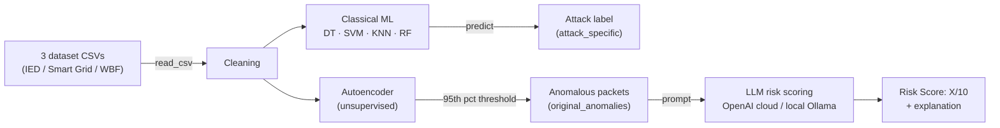

# Modbus ICS-IDS — Autoencoder + LLM Risk Scoring

An Intrusion Detection System (IDS) for an Industrial Control System (ICS) simulated with [Curtin ICS-SimLab](https://github.com/JaxsonBrownie/ICS-SimLab), detecting anomalies in Modbus/TCP packets using an autoencoder, classifying attack types with classical ML, and scoring risk with an LLM (OpenAI cloud or a local model via Ollama).

The entire pipeline lives in [`ics_simlab_sanh.ipynb`](ics_simlab_sanh.ipynb). This file explains how to run it from scratch.

## Table of Contents

- [Pipeline Overview](#pipeline-overview)
- [Requirements Before Running](#requirements-before-running)
- [Cell Run Order](#cell-run-order)
- [Files Already in the Repo](#files-already-in-the-repo)
- [Issues Encountered & How They Were Resolved](#issues-encountered--how-they-were-resolved)
- [Experiment Log](#experiment-log)
- [Autoencoder Architecture Comparison: Linear vs LSTM vs VAE](#autoencoder-architecture-comparison-linear-vs-lstm-vs-vae)
- [Prompt 2: Structured Prompt for Risk-Scoring](#prompt-2-structured-prompt-for-risk-scoring)
- [3-Way Split for AE Evaluation (Experimental, Paused)](#3-way-split-for-ae-evaluation-experimental-paused)

## Pipeline Overview



`Cleaning` produces a dataset shared by **two independent branches**:

- **Classical ML** (Decision Tree, SVM, KNN, Random Forest) — only classifies the attack type, unrelated to the LLM.
- **Autoencoder** — unsupervised anomaly detection; anomalous packets are then fed to the LLM for risk scoring.

## Requirements Before Running

| Component | Note |
|---|---|
| Python venv | Needs `pandas`, `numpy`, `scikit-learn`, `torch`, `matplotlib`, `requests`, `scipy`, `openai`, `kaggle`. Select this kernel in VS Code/Jupyter before running. |
| Data | The notebook reads the dataset from a fixed path in the `DATA_DIR` variable (cells "Load Datasets", "Download Dataset (Kaggle)", "Cleaning"). **Change this path to match your machine** before running — it defaults to the original development machine. Needs 3 files: `dataset_ied_packetv4.csv`, `dataset_sg_packetv4.csv`, `dataset_wbf_packetv4.csv`. |
| Pretrained model weights | This repo already includes trained `.pt`/`.pkl` files (see [Files Already in the Repo](#files-already-in-the-repo)) — no need to re-run the "Load Models"/"Download Dataset" cells. |
| `OPENAI_API_KEY` | Only needed to run the cloud LLM pipeline (cell "Complete Pipeline"). Costs money — see the warning below. |
| Ollama | Only needed to run the local LLM comparison (cell "Local LLM Comparison"). Requires `ollama serve` running and the models to test already `ollama pull`ed. |

> A machine without a GPU still runs fine on CPU — `torch.cuda.is_available()` returning `False` is normal, not an error. The autoencoder and Ollama models are just slower, not broken.

## Cell Run Order

The notebook is organized into sections, run sequentially top to bottom:

1. **Datasets** — `Load Datasets` (required) → `Download Dataset (Kaggle)` (optional, only if data isn't present yet) → `Load Models` (optional, downloads pretrained weights from the original GitHub repo — the 3 RF files will always 404 since the original repo has no `v4` build for RF, which is fine since the RF cell below retrains it anyway).
2. **Data Processing** — `Cleaning` (required) → `Data Splitting` (required before the ML section).
3. **Visualisation** — optional, just for viewing stats/t-SNE.
4. **Classical ML** — `DT`, `SVM`, `KNN`, `RF`: 4 independent cells, each trains + evaluates + cross-tests across the 3 datasets.
5. **Deep Learning** — `AutoEncoder` (loads the existing weights by default, doesn't retrain) and `AutoEncoder_Test` (a smaller-latent variant, retrains from scratch by default).
6. **Intrusion Detection Pipeline** — 2 identical "Complete Pipeline" cells, differing only in model (the older `o4-mini` and the newer `gpt-5.6-luna` — run the newer one). Requires `OPENAI_API_KEY`. **This cell defines the variables/functions shared by step 7** (`attacks`, `original_anomalies`, `df_orig`, `select_anomalous_packet`, `extract_packet_info`, `create_prompt`) — at least one of these two cells must be run first, even if you're not using OpenAI.
7. **Local LLM Comparison (Ollama)** — replaces OpenAI with local models, free but much slower on CPU. Default: 4 models × 8 attack types × 3 repeats = 96 calls.
8. **Random Stuff** (end of notebook) — scratch cells plotting timelines, depend on variables from step 6, not needed for the main pipeline.

## Files Already in the Repo

| File | Produced by |
|---|---|
| `*_ae32_relu_model.pt` | Trained autoencoder (Deep Learning) — **32-dim latent, fixed `nn.ReLU()` activation**, the original architecture from the "Autoencoder (AE)" cell in `ics_simlab_sanh.ipynb`. This is the AE backend for the entire `local_multi_model_ae32_relu.py` pipeline (the anomaly-filtering stage before feeding into the LLM for risk scoring) — different from the tuned/experimental AE variants in `retrain_ae_9dim.py`/`tune_ae_9dim.py`/`tune_ae_lstm_vae.py` (9-dim, several activations, LSTM, VAE). |
| `*_dt_model.pkl`, `*_knn_model.pkl` | Trained classical ML models |
| `*_threshold.txt` | The autoencoder's reconstruction-error threshold (95th percentile) |
| `local_llm_comparison_results.csv` | Per-call details from the local Ollama model comparison |
| `local_llm_comparison_summary.csv` | Comparison table of speed / consistency / format compliance across models |
| `local llms.py` | A standalone script equivalent to the "Local LLM Comparison" cell, runnable outside the notebook if the required variables already exist in the kernel |

The files above live in the repo root because they're shared across several scripts/notebooks (e.g. `smart_grid_ae32_relu_model.pt` is loaded by both `ics_simlab_sanh.ipynb` and `local_multi_model_ae32_relu.py`).

### Log + results for 5 standalone scripts (`retrain_ae_9dim.py`, `tune_ae_9dim.py`, `tune_ae_lstm_vae.py`, `local_multi_model_ae32_relu.py`, `local_multi_model_ae32_relu_structured_prompt.py`)

Each script collects its own log + CSV/`.pt`/`.txt` output into a folder of the same name (created automatically at import time, even when only imported as a dependency):

```
retrain_ae_9dim/    ← retrain_ae_9dim.py   (*_ae_model_9dim.pt, *_threshold_test.txt, log)
tune_ae_9dim/       ← tune_ae_9dim.py      (*_ae_tuning_results.csv, log)
tune_ae_lstm_vae/   ← tune_ae_lstm_vae.py  (*_ae_arch_tuning_results*.csv, *summary*.csv, log)
local_multi_model_ae32_relu/       ← local_multi_model_ae32_relu.py (*_results*.csv, *_dataset_timing*.csv, *_summary*.csv, *_risk_score_pivot_*.csv, log) — original prompt (250 characters, unstructured)
local_multi_model_ae32_relu_structured_prompt/ ← local_multi_model_ae32_relu_structured_prompt.py (same output format as above) — prompt_2, see the "Prompt 2" section below
```

The `.py` files themselves stay in the repo root (run `python3 <script_name>.py` as usual) — only the output goes into the folder. Since the folder is created right at import time (before any file is written), redirecting the log via shell into that folder also works from the very first run, e.g.:

```bash
python3 tune_ae_lstm_vae.py --tag 4th_attempt 2>&1 | tee tune_ae_lstm_vae/run_$(date +%Y%m%d_%H%M).log
```

The `.pt`/`.pkl`/`.txt` files shared across multiple scripts (table above) are **not** in these folders — moving them would cause a `FileNotFoundError` in whichever other script loads them.

## Issues Encountered & How They Were Resolved

Recorded here to avoid re-debugging from scratch:

- **`Request timed out.` when calling an Ollama model** — the `openai` SDK automatically retries twice on timeout by default, so a single failed call actually waits up to ~3× `REQUEST_TIMEOUT_SEC` before reporting an error. Set `max_retries=0` in `OpenAI(...)` in the "Local LLM Comparison" cell to fail fast after exactly one attempt.
- **Unusual CPU usage after a timeout/interrupt** — Ollama doesn't cancel a generation job when the client times out or is interrupted; the old job keeps running in the background, competing for CPU with subsequent calls. If suspected, run `ollama ps` to check the loaded model, and `sudo snap restart ollama` (or restart the corresponding Ollama service) to clean up before running again.
- **`qwen3:4b` and `deepseek-r1:8b` much slower than `phi4-mini`** — both are reasoning models that automatically generate an internal `<think>...</think>` block before answering. Tried disabling it via `think: false` (both the OpenAI-compat client and the native Ollama API) and the `/no_think` prompt convention — **no way to turn it off** with the model build in use; this is a limitation of the model/Ollama, not a code bug.
  - **Retest 2026-09-06 (`local_multi_model_ae32_relu_structured_prompt.py`, prompt_2, `--tag run2`):** retested both models with the current `use_llm_local()` (calling the native `/api/chat` + `think: false`). Results were **clearly different**:
    - **`deepseek-r1:8b` is now FIXED** — `think:false` works correctly, 100% success rate, 100% format compliance, reasonable speed (avg 42s/call, 928s total for 22 calls across all 3 datasets).
    - **`qwen3:4b` is STILL NOT FIXED** — output starts with `"We are given the following packet data: ..."`, meaning the model writes its entire reasoning chain straight into `content` instead of a `<think>` block (or a separate `thinking` field), ignoring `think:false`. Consequences: `avg_completion_tokens` 3536 (8-50x more than other models), `format_compliance_%` only 65% (often fails to produce the `Risk Score:` line in time), 2/22 calls timed out outright (>600s), total time 3980s — this one model alone took almost as long as the other 6 models combined. Conclusion: `qwen3:4b` should be treated as a model with a known limitation (not fairly comparable) when comparing format compliance/speed, unless Ollama/the model gets a different update.
- **Downloaded `.pt`/`.pkl` file is an HTML error page** — the original "Load Models" cell didn't check the HTTP status before writing the file, so an error response got written over the file, corrupting it. Added a status code check, explicitly skipping files that don't exist (like the 3 RF files above) instead of writing garbage.
- **`ModuleNotFoundError` despite the library being installed** — caused by VS Code selecting the wrong Python kernel (not this repo's `.venv` kernel). Reselect the correct kernel via "Select Kernel" in the notebook's top-right corner.
- **Code fixed but running still produces the old error** — if the `.ipynb` file was edited from outside VS Code (script, git, ...) while open, the editor may still be showing the old version from memory. Use `Ctrl+Shift+P` → "Revert File" to reload from disk before running again.
- **Attack "sporadic sensor measurement injection" (attack #5) missing from the LLM results for Smart Grid and Water Bottle Factory** — not a CSV-aggregation bug. `build_prompts_for_dataset()` (`local_multi_model_ae32_relu.py`) only builds a prompt for an attack type if the autoencoder labels at least one packet of that type as an *anomaly* (MSE > threshold); if not, it prints `[SKIPPED] No anomaly detected by the AE...` and skips that attack entirely — see the log at `local_multi_model_ae32_relu/local_multi_model_log.txt`. Re-checking by running the AE on the full dataset (no downsampling) shows attack #5 never exceeds the threshold on Smart Grid (0/370 packets, highest MSE 0.0028 vs threshold 0.0097) or Water Bottle Factory (0/5200 packets, highest MSE 0.0076 vs threshold 0.0096) — while on Intelligent Electronic Device it does (37/8600, 0.4%) because that dataset's threshold is ~500x lower (1.97e-05, computed as the 95th percentile of MSE on the normal set — see the `detect_anomaly()` cell in the notebook; each dataset computes its threshold independently so they're not consistent across the 3 datasets). Across all 3 datasets, attack #5 always has the lowest reconstruction MSE of the 8 attack types (makes sense: it injects slight/scattered sensor value deviations, so the packet looks close to normal traffic) — it only slips through on IED thanks to that dataset's unusually low threshold, not because the AE "detects it better" there. This is a genuine limitation of the 2-stage AE → LLM pipeline (not a code bug): the AE stage filters first, the LLM only ever sees packets the AE has already flagged as anomalous, so whatever attack the AE misses, the LLM never gets a chance to score.
- **`gemma4:12b` returns an empty risk-score on almost every call (all 3 datasets)** — not an error/timeout: `completion_tokens` is consistently ~3800 each time (`prompt_tokens` ~270-310 + completion ≈ 4096), exactly matching **Ollama's default context window (`num_ctx=4096`)** when the request doesn't set that value. `gemma4:12b` is a model with "thinking" capability (checked via `ollama`'s `/api/tags`) — with the native `/api/chat` endpoint, the reasoning lives in the `message.thinking` field, separate from `message.content` (the actual answer); if the model burns through its entire token budget on `thinking` without finishing, it gets cut off **before it even starts generating `content`** → `content` ends up completely empty (not empty from being cut off mid-generation). Since the request still "succeeds" (HTTP 200, no exception), the old code couldn't catch this — a silent failure, printing neither `OK` nor `ERROR` in the log, just leaving a blank cell in the CSV.
  - **First fix attempt (2026-08-24, ineffective):** added `NUM_CTX = 16384`, passed via `extra_body={"options": {"num_ctx": NUM_CTX}}` in `use_llm_local()` (still calling through the OpenAI-compat client `client.chat.completions.create`). Rerunning (`--tag gemma4_ctxfix`) produced results identical to before (20/22 calls still stopped at exactly 4096 total `completion_tokens`, only 1/22 got a risk score) — **because the OpenAI-compat endpoint `/v1/chat/completions` on the Ollama build in use (0.32.14) silently ignores the `options`/`num_ctx` field** (manually verified: sending a request with `options.num_ctx=16384` via `/v1/chat/completions` then checking `curl :11435/api/ps` → still reports `context_length: 4096`; the identical request sent via the native `/api/chat` endpoint makes `ollama ps` correctly report `context_length: 16384` with `size_vram` increasing accordingly).
  - **Second fix attempt (2026-08-24, right direction but not enough):** changed `use_llm_local()` to call the native `POST /api/chat` endpoint directly via `requests` instead of the `openai` SDK/OpenAI-compat (`check_model_available()` still uses the SDK since it only lists models, unaffected). Confirmed via `ollama ps` that the model loads correctly with `context_length: 16384`. But rerunning (`--tag gemma4_ctxfix2`) showed a larger `num_ctx` doesn't fix the root cause: the IED dataset took **56 minutes for 8 calls**, still only 1/8 got a risk score — the model just "thinks" longer (up to the full 16k tokens) rather than actually *finishing* thinking. Stopped partway through (didn't wait for all 3 datasets, estimated another 1.5-2h) to try a different approach.
  - **Third fix attempt (2026-08-24, successful):** added `"think": false` at the top level of the body when calling `/api/chat` (alongside keeping `num_ctx=16384` as a safety net). Manual testing via the native endpoint confirmed `think:false` fully disables reasoning for `gemma4:12b` (the `thinking` field returns `None`, `content` has the answer immediately), cutting time from hundreds of seconds/completely empty down to **~2-3 seconds per call**. The final rerun (`--tag gemma4_thinkfix`) achieved **100% success, 100% format compliance**, with all 22 calls (3 datasets) taking only **66 seconds total**. Note: the entry just above (about `qwen3:4b`/`deepseek-r1:8b`) recorded that `think:false` was tried via **both paths** (OpenAI-compat and the native API) and still couldn't be disabled — different from this `gemma4:12b` case, where only the OpenAI-compat path was confirmed buggy, while the native path did disable it. Those two models **haven't been retested with the exact `"think": false` syntax used here** (the current `use_llm_local()`) so it's unclear whether they'd improve — if `qwen3:4b`/`deepseek-r1:8b` are needed again, retest before drawing conclusions.
  - **Lesson learned:** with this Ollama build (0.32.14), to reliably set `options`/`think` for a "thinking" model, you must call the native `/api/chat`/`/api/generate` endpoint via `requests` — the OpenAI-compat client (the `openai` SDK pointed at `/v1/...`) silently ignores these fields instead of raising an error, which is easy to misdiagnose as "the model itself is just slow/doesn't support disabling thinking" when it's actually a bug in the compatibility layer. `client.models.list()` (OpenAI-compat) is still fine to use for checking whether a model has been pulled, since it's unrelated to generation.
- **`qwen3:14b` repeatedly fails with `400 Client Error: Bad Request for url: http://localhost:11435/api/chat`** (2026-08-25, see `local_multi_model_ae32_relu/local_multi_model_run_20260824_0949.log`) — the first call for this model on the Smart Grid dataset succeeded but was very slow (126.8s, abnormal compared to other models), and after that **every subsequent call for this model on that dataset failed with a 400** until the dataset finished. The root cause **could not be determined** because `use_llm_local()` at the time only caught `response.raise_for_status()`, logging just the status line (`"400 Client Error: ..."`) without the response body — while the body is exactly where Ollama writes the real reason (out of VRAM, model runner crash, etc.).
  - **Fixed (2026-08-25):** changed `use_llm_local()` to check `response.ok` itself and raise with `response.text` attached (up to 1000 characters) instead of using `raise_for_status()` — the next time this error occurs, the log will show exactly what Ollama reported instead of just a generic status line.
  - **Unconfirmed hypothesis:** `qwen3:14b` is the heaviest of the 8 models being tested (9.3GB), running with the shared `NUM_CTX=16384` (originally raised to fix `gemma4:12b`, now applied to all 8 models) on a GTX 3060 GPU — the large context + 14B model may cause the model runner to run out of VRAM/crash after the first generation (127s is an abnormal sign), with subsequent requests failing with 400 because that runner is already broken. If the error recurs, check `ollama ps` (look at `size_vram`) and the Ollama server log right when it happens to confirm; if confirmed, consider setting a lower `NUM_CTX` specifically for the heavy models (`qwen3:14b`, `gemma4:12b`) instead of sharing 16384 across every model.
- **`FileNotFoundError: Could not find 'dataset_wbf_packetv4.csv'`** appeared partway through the log `local_multi_model_ae32_relu/local_multi_model_run_20260824_0949.log`, even though the Intelligent Electronic Device and Smart Grid datasets had loaded successfully right before it in the **same process** (so `DATA_DIR` — resolved once from cwd at `retrain_ae_9dim.py` import time — must have been correct, not a case of the working directory changing mid-run). The file `dataset_wbf_packetv4.csv` **genuinely exists** (88MB, confirmed right within that same log via an `ll data/` command). This log file is actually a raw terminal paste (mixed with ANSI control characters, shell history, `ll`/`git status` output interleaved), not clean stdout, so this is most likely a traceback from **an older run that got mixed in**, not necessarily belonging to the run named in that log. No bug found in the code (`find_dataset_csv`/`DATA_DIR` unchanged, simple logic). **Recommendation:** just rerun normally (the data is already there); next time, redirect a clean log with `python3 local_multi_model_ae32_relu.py ... > run.log 2>&1` instead of copy-pasting the terminal, to avoid noise and make debugging easier if a real error occurs.

## Experiment Log

Records the purpose + outcome of each `local_multi_model_ae32_relu.py` run for later aggregation of experiments. As of 2026-08-24, the script requires a `--purpose "..."` flag (see `python3 local_multi_model_ae32_relu.py --help`); the purpose is printed to the log and stored in the `run_purpose` CSV column. A partial run can be done with `--models`/`--datasets`, and `--tag` avoids overwriting a previous run's results.

**Note applying to ALL runs in the table below:** the anomaly detection stage uses the autoencoder with **32-dim latent, fixed `nn.ReLU()`** (the `AutoEncoder` class in `local_multi_model_ae32_relu.py`, loaded from `*_ae32_relu_model.pt`) — not any of the tuned/VAE/LSTM variants in the other scripts. If the AE backend is swapped later (e.g. to a tuned VAE), the older rows in this table will no longer reflect current behavior and should be annotated with the AE version they used.

| Date | Output files | Purpose | Scope | Result |
|---|---|---|---|---|
| ~2026-08-19 | `local_multi_model_results_1.csv`, `..._dataset_timing_1.csv`, `..._summary_1.csv` | Compare risk-scoring across 8 local models (phi4-mini → qwen3:14b) on all 3 datasets (no `--purpose` flag yet, inferred from the log) | 8 models × 3 datasets × 8 attack types | Found 2 issues: (1) attack #5 "sporadic sensor measurement injection" missing on Smart Grid/WBF due to the AE threshold being too high — see the explanation above; (2) `gemma4:12b` returns an empty risk-score on every call because the default `num_ctx` of 4096 is too small — see the explanation above. `openthinker:7b` was skipped entirely (not `ollama pull`ed yet). |
| 2026-08-24 | `local_multi_model_results_gemma4_ctxfix.csv`, `..._dataset_timing_gemma4_ctxfix.csv`, `..._summary_gemma4_ctxfix.csv` | Rerun `gemma4:12b` alone on all 3 datasets after adding `num_ctx=16384` via the OpenAI-compat client's `extra_body` | `gemma4:12b` × 3 datasets × 8 attack types | **Fix ineffective** — results almost identical to the first run (`format_compliance_% = 4.5`, only 1/22 calls got a risk score). Further investigation found `/v1/chat/completions` ignores `options.num_ctx` — see "Issues Encountered" above. |
| 2026-08-24 | _(not saved — stopped partway through; the script only writes CSVs after the entire run finishes)_ | 2nd rerun after changing `use_llm_local()` to call the native `/api/chat` endpoint directly (confirmed via `ollama ps` that `num_ctx=16384` was actually applied this time) | `gemma4:12b` × 3 datasets × 8 attack types | **Stopped partway through** — the IED dataset finished after 56 minutes (8 calls) but still only 1/8 got a risk score; a larger `num_ctx` only made the model "think" longer, not finish thinking. Estimated another 1.5-2h needed for the remaining 2 datasets at a similar success rate → not worth it, switched to trying `think: false`. |
| 2026-08-24 | `local_multi_model_results_gemma4_thinkfix.csv`, `..._dataset_timing_gemma4_thinkfix.csv`, `..._summary_gemma4_thinkfix.csv` | 3rd rerun after adding `"think": false` to the `/api/chat` request to fully disable `gemma4:12b`'s internal reasoning instead of just giving it a bigger token budget | `gemma4:12b` × 3 datasets × 8 attack types | **Successful** — 100% success rate, 100% format compliance, all 22 calls (3 datasets) took only 66s total (previously hundreds of seconds or completely empty). |
| 2026-09-06 | `local_multi_model_results_run2.csv`, `..._dataset_timing_run2.csv`, `..._summary_run2.csv` (script: `local_multi_model_ae32_relu_structured_prompt.py`, prompt_2, run on lab232-a04) | Compare all 7 pulled models (missing `openthinker:7b`) × 3 datasets with the structured (5-field) prompt, after fixing the prompt's Vietnamese-text leak | 7 models × 3 datasets × 8 attack types | See details in "Issues Encountered" — `deepseek-r1:8b` confirmed fixed (100% success/compliance), `qwen3:4b` still can't disable thinking (format_compliance 65%, 2 timeouts), 1 transient CUDA crash on `phi4-mini`/WBF, and Water Bottle Factory noticeably slowed down the reasoning-capable models (qwen3:14b/deepseek-r1:8b/gemma4:12b) compared to the other 2 datasets. |

## Autoencoder Architecture Comparison: Linear vs LSTM vs VAE

Besides the original Linear/MLP autoencoder (`retrain_ae_9dim.py`, `tune_ae_9dim.py`), 2 alternative architectures were tuned via `tune_ae_lstm_vae.py`: an autoencoder using `nn.LSTM` (treating a packet's 18-feature vector as an 18-step "sequence" — the data has no real temporal order between features, so this is a forced mapping, not genuine sequence modeling) and a Variational Autoencoder (VAE, still using Linear layers but with a `(mu, logvar)` distributional latent bottleneck instead of a deterministic one).

Random search results (16 LSTM trials + 20 VAE trials per dataset, fixed seed for a fair comparison — see [`tune_ae_lstm_vae_log.txt`](tune_ae_lstm_vae_log.txt)):

| Dataset | Model | F1 (attack) | Precision | Recall | Best trial time |
|---|---|---|---|---|---|
| IED | **VAE** | **0.9239** | 0.9474 | 0.9014 | 2.55s |
| IED | LSTM | 0.8622 | 0.9409 | 0.7957 | 5.45s |
| Smart Grid | **VAE** | **0.9280** | 0.9478 | 0.9090 | 0.51s |
| Smart Grid | LSTM | 0.8449 | 0.9388 | 0.7680 | 8.24s |
| Water Bottle Factory | **VAE** | **0.9501** | 0.9500 | 0.9502 | 0.93s |
| Water Bottle Factory | LSTM | 0.8487 | 0.9393 | 0.7741 | 3.18s |

**Observations:**

- **VAE beats LSTM on all 3/3 datasets**, by 6-10 F1 points, driven by **recall** (VAE ~0.90-0.95 vs LSTM ~0.77-0.81) — precision is close on both sides (~0.94). LSTM misses far more attacks, which makes sense since the LSTM architecture has nothing real to exploit from a fake feature "sequence" (no genuine temporal order).
- **LSTM is much more hyperparameter-sensitive**: F1 ranges from 0.53–0.85 just from changing batch_size/epochs/hidden_size (Smart Grid), making it hard to pick a reliable configuration.
- **VAE is ~2.7x faster per trial** on average (VAE ~1.3-1.4s vs LSTM ~3.8s) since it doesn't need sequential unrolling like LSTM.
- **Important finding about VAE's `beta` (KL-divergence weight)**: most of the worst configs land on `beta=1.0` (over-regularizing the latent space, losing the reconstruction detail needed to distinguish anomalous packets), while the best config on **all 3 datasets uses `beta=0.1`**. Narrowed `VAE_SEARCH_SPACE["beta"]` from `[0.1, 0.5, 1.0]` down to `[0.05, 0.1, 0.2]` in `tune_ae_lstm_vae.py` to focus trials on the good region instead of repeatedly reconfirming `beta=1.0` is bad.

**Conclusion:** VAE fits this tabular Modbus packet data better than LSTM, both in detection quality and training speed. The VAE search space has been narrowed based on the `beta` finding; the next run will verify this result with the refined search space.

## Prompt 2: Structured Prompt for Risk-Scoring

`local_multi_model_ae32_relu.py` uses the original prompt (250-character limit, no specific format required) — the LLM just returns 1-2 generic sentences + `Risk Score: X/10`, not enough information for an operator to determine the source, root cause, affected device, or the action to take.

`local_multi_model_ae32_relu_structured_prompt.py` (**prompt_2**) replaces it with a prompt requiring exactly 5 fields, one per line:

```
Source: <suspected source IP/MAC, and whether it is internal or external to the local network>
Likely Cause: <one sentence - the suspected type of behavior and why, based on the signals below>
Affected Asset: <the destination IP/device being affected>
Recommendation: <one specific action the operator should take right now>
Risk Score: X/10
```

The input fed into the prompt was also expanded compared to the original: added source/destination MAC (already computed in `extract_packet_info()` but unused by the original), and translated Modbus function codes into their meaning (e.g. `3 (Read Holding Registers)` instead of just the number `3`) so a small model (phi4-mini...) reasons about the cause more accurately instead of having to recall the Modbus code table from memory.

**Real example** (Smart Grid, "function code scan" attack, `phi4-mini` model, function code `102` — not valid under the Modbus standard, flow rate 39 pkt/s vs a baseline of 15.07 pkt/s):

| | Original Prompt | Prompt 2 |
|---|---|---|
| Output | `The packet flow rate is significantly higher than normal, indicating potential malicious activity. Risk Score: 8/10.` | `Source: 192.168.0.1`<br>`Likely Cause: Modbus flooding attack - high packet rate indicating potential DoS; Modbus function code 102 suggests probing/fuzzing`<br>`Affected Asset: 192.168.0.31`<br>`Recommendation: Block source IP 192.168.0.1, increase network monitoring for further investigation`<br>`Risk Score: 8/10` |
| Automatic parsing | Only `risk_score` | `source`, `likely_cause`, `affected_asset`, `recommendation`, `risk_score` — each field its own CSV column |

**Note:** the field structure makes the output easier to read/parse, but **does not guarantee the model diagnoses the attack correctly** — that's a limitation of the model's capability, not a prompt bug. The ground truth in the example above is "function code scan" (the key signal being the invalid function code `102`), but `phi4-mini` (3.8B) leans toward interpreting it as "flooding/DoS" since it's drawn more to the high flow rate.

The `format_all_fields_present` column (replacing `format_ok_has_score`/`format_ok_length` from the original) measures the % of calls with all 5 fields present, used in `summarize_results()` to compute `format_compliance_%`.

## 3-Way Split for AE Evaluation (Experimental, Paused)

**Status: paused after one exploratory run — needs more testing before being adopted anywhere else in the repo.** Notes below are so this can be picked back up later without re-deriving the context.

### Motivation

Every AE evaluation method elsewhere in this repo (the original notebook's `preprocess_ae()`/`detect_anomaly()`, and `evaluate_config()`/`eval_ae_9dim()` in the tuning scripts) computes the anomaly threshold from the training data itself, then evaluates on a set that still includes those training rows — a form of data leakage. `retrain_ae_3way_split.py` was built to test whether this leakage was making reported metrics look artificially good.

### What it does

Trains the same 32-dim architecture as `local_multi_model_ae32_relu.py` (fixed `nn.ReLU()`), but splits the **normal-only** data three ways instead of the usual "train on all normal, evaluate on everything":

```
Normal data → split 3 ways:
  - Train      (70%) → only this is used to fit the AE
  - Validation (15%) → only this is used to compute the anomaly threshold (never trained on)
  - Test       (15%) → held out completely, combined with ALL attack rows for final evaluation
```

For direct comparison, it also reproduces the original leaky methodology (threshold from train data, evaluate on everything) **on the exact same trained model**, so only the evaluation methodology differs between the two reported rows — training data volume and model weights are held constant.

Output goes into `retrain_ae_3way_split/`: `*_ae_model_3way.pt`, `*_threshold_3way.txt`, and `leaky_vs_3way_comparison.csv`.

### Result from the one full run so far (2026-09-08, all 3 datasets, 30 epochs)

| Dataset | Method | Precision (attack) | Recall (attack) | F1 (attack) |
|---|---|---|---|---|
| IED | 3-way split (honest) | **0.9549** | 0.8815 | **0.9168** |
| IED | Leaky (original method) | 0.7621 | 0.8802 | 0.8169 |
| Smart Grid | 3-way split (honest) | **0.9709** | 0.9357 | **0.9530** |
| Smart Grid | Leaky (original method) | 0.8203 | 0.9368 | 0.8747 |
| Water Bottle Factory | 3-way split (honest) | **0.9364** | 0.9383 | **0.9374** |
| Water Bottle Factory | Leaky (original method) | 0.6879 | 0.9380 | 0.7937 |

**Surprising finding: the honest 3-way split scores HIGHER on all 3/3 datasets** (by 0.078–0.144 F1 points) — the opposite of the usual assumption that leakage makes results look better. Recall is nearly identical between the two methods; the gap comes almost entirely from precision. Root cause: the leaky threshold is calibrated from training data the model already fits well (low reconstruction error → a low/strict threshold), then applied to a much larger normal population that's mostly *unseen* (val+test rows never used in training, which naturally reconstruct with higher error) — so that too-strict threshold flags a lot of genuinely normal traffic as false positives when evaluated broadly.

### Important caveats before trusting this comparison further

- **The "leaky" numbers above are NOT the historical numbers reported elsewhere in this repo.** Both rows in the table use a model trained on only 70% of normal data (the 3-way split's train portion) — this was a controlled experiment isolating "evaluation methodology" as the only variable, not a reproduction of what `tune_ae_9dim.py`/`local_multi_model_ae32_relu.py` actually reported (those trained on 100% of normal data). If revisiting this, consider also comparing against a model trained on 100% of normal data to see whether the extra 30% of training data changes the picture.
- **Test-set class imbalance (normal vs attack ratio) does not cause overfitting/underfitting** — that's determined entirely during training (which only ever sees normal data, and only the train split of it), before any evaluation happens. Imbalance only affects the statistical reliability of precision/recall estimates, which isn't a serious concern here since test-set attack counts are large (11.6k–40k per dataset).
- The raw dataset's `attack_specific` column encodes normal packets as `NaN`, not `0` — the existing `is_attack = (attack_specific != 0)` logic is still correct because `clean_dataset()`/`clean_dataset_dl()` calls `fillna(0)` earlier in the pipeline, but this is worth remembering if touching that logic again. The raw data also already provides an `attack_binary` column that agrees with this derivation 99.5–100% of the time and could be used directly instead of re-deriving it.
- This is packet-capture data with a time dimension (`frame_time_relative`); the current split is a pure random row-level split, which risks leaking temporal/session correlation between adjacent packets across splits. A time-block split might be worth testing as a stricter alternative.
- Only tested on the 32-dim architecture so far - not yet applied to the 9-dim variant (`retrain_ae_9dim.py`) or the tuning scripts (`tune_ae_9dim.py`, `tune_ae_lstm_vae.py`), which have the same leakage pattern.

## Data Source & Simulation

Original dataset and weights from [ICS-SimLab-IDS](https://github.com/JaxsonBrownie/ICS-SimLab-IDS) by Jaxson Brownie, based on the [Curtin ICS-SimLab](https://github.com/JaxsonBrownie/ICS-SimLab) simulator.
