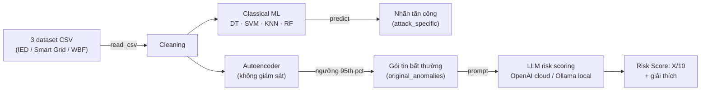

# Modbus ICS-IDS — Autoencoder + LLM Risk Scoring

Intrusion Detection System (IDS) cho hệ thống điều khiển công nghiệp (ICS) mô phỏng bằng [Curtin ICS-SimLab](https://github.com/JaxsonBrownie/ICS-SimLab), phát hiện bất thường trên gói tin Modbus/TCP bằng autoencoder, phân loại kiểu tấn công bằng ML cổ điển, và chấm điểm rủi ro bằng LLM (OpenAI cloud hoặc model local qua Ollama).

Toàn bộ pipeline nằm trong [`ics_simlab_sanh.ipynb`](ics_simlab_sanh.ipynb). File này hướng dẫn cách chạy nó từ đầu.

## Mục lục

- [Tổng quan pipeline](#tổng-quan-pipeline)
- [Yêu cầu trước khi chạy](#yêu-cầu-trước-khi-chạy)
- [Thứ tự chạy cell](#thứ-tự-chạy-cell)
- [File có sẵn trong repo](#file-có-sẵn-trong-repo)
- [Các vấn đề đã gặp & cách xử lý](#các-vấn-đề-đã-gặp--cách-xử-lý)

## Tổng quan pipeline

`Cleaning` tạo ra một dataset dùng chung cho **hai nhánh độc lập**:

- **Classical ML** (Decision Tree, SVM, KNN, Random Forest) — chỉ phân loại kiểu tấn công, không liên quan tới LLM.
- **Autoencoder** — phát hiện bất thường không giám sát, gói tin bất thường mới được đưa tiếp vào LLM để chấm risk score.

## Yêu cầu trước khi chạy

| Thành phần | Ghi chú |
|---|---|
| Python venv | Cần `pandas`, `numpy`, `scikit-learn`, `torch`, `matplotlib`, `requests`, `scipy`, `openai`, `kaggle`. Chọn đúng kernel này trong VS Code/Jupyter trước khi chạy. |
| Dữ liệu | Notebook đọc dataset từ đường dẫn cố định trong biến `DATA_DIR` (cell "Load Datasets", "Download Dataset (Kaggle)", "Cleaning"). **Đổi lại đường dẫn này cho khớp máy bạn** trước khi chạy — mặc định đang trỏ tới máy phát triển gốc. Cần 3 file: `dataset_ied_packetv4.csv`, `dataset_sg_packetv4.csv`, `dataset_wbf_packetv4.csv`. |
| Model weight có sẵn | Repo này đã kèm sẵn các file `.pt`/`.pkl` đã train (xem [File có sẵn trong repo](#file-có-sẵn-trong-repo)) — không bắt buộc chạy lại cell "Load Models"/"Download Dataset". |
| `OPENAI_API_KEY` | Chỉ cần nếu chạy pipeline LLM cloud (cell "Complete Pipeline"). Tốn phí — xem cảnh báo bên dưới. |
| Ollama | Chỉ cần nếu chạy so sánh LLM local (cell "Local LLM Comparison"). Cần `ollama serve` đang chạy và đã `ollama pull` các model muốn test. |

> Máy không có GPU vẫn chạy được bình thường trên CPU — `torch.cuda.is_available()` trả `False` là chuyện thường, không phải lỗi. Autoencoder và các model Ollama chỉ chậm hơn, không hỏng.

## Thứ tự chạy cell

Notebook chia theo section, chạy tuần tự từ trên xuống:

1. **Datasets** — `Load Datasets` (bắt buộc) → `Download Dataset (Kaggle)` (tuỳ chọn, chỉ khi chưa có data) → `Load Models` (tuỳ chọn, tải sẵn weight từ GitHub gốc — 3 file RF sẽ luôn báo 404 vì repo gốc không có bản `v4` cho RF, không sao vì cell RF bên dưới tự train lại).
2. **Data Processing** — `Cleaning` (bắt buộc) → `Data Splitting` (bắt buộc trước phần ML).
3. **Visualisation** — tuỳ chọn, chỉ để xem thống kê/t-SNE.
4. **Classical ML** — `DT`, `SVM`, `KNN`, `RF`: 4 cell độc lập, tự train + đánh giá + test chéo giữa 3 dataset.
5. **Deep Learning** — `AutoEncoder` (mặc định load lại weight có sẵn, không train lại) và `AutoEncoder_Test` (biến thể latent nhỏ hơn, mặc định tự train lại từ đầu).
6. **Intrusion Detection Pipeline** — 2 cell "Complete Pipeline" giống nhau, chỉ khác model (`o4-mini` cũ và `gpt-5.6-luna` mới hơn — nên chạy bản mới). Cần `OPENAI_API_KEY`. **Cell này định nghĩa các biến/hàm dùng chung cho bước 7** (`attacks`, `original_anomalies`, `df_orig`, `select_anomalous_packet`, `extract_packet_info`, `create_prompt`) — phải chạy ít nhất 1 trong 2 cell này trước, kể cả khi không dùng OpenAI.
7. **So sánh Local LLM (Ollama)** — thay OpenAI bằng model local, miễn phí nhưng chậm hơn nhiều trên CPU. Mặc định 4 model × 8 loại tấn công × 3 lần lặp = 96 lần gọi.
8. **Random Stuff** (cuối notebook) — các cell scratch vẽ timeline, phụ thuộc biến từ bước 6, không cần thiết cho pipeline chính.

## File có sẵn trong repo

| File | Sinh ra từ |
|---|---|
| `*_ae_model.pt` | Autoencoder đã train (Deep Learning) |
| `*_dt_model.pkl`, `*_knn_model.pkl` | Model ML cổ điển đã train |
| `*_threshold.txt` | Ngưỡng reconstruction error (95th percentile) của autoencoder |
| `local_llm_comparison_results.csv` | Chi tiết từng lần gọi model local qua Ollama |
| `local_llm_comparison_summary.csv` | Bảng so sánh tốc độ / độ ổn định / độ tuân thủ format giữa các model |
| `local llms.py` | Bản script độc lập tương đương cell "Local LLM Comparison", chạy được ngoài notebook nếu đã có sẵn các biến cần thiết trong kernel |

## Các vấn đề đã gặp & cách xử lý

Ghi lại để đỡ mất công debug lại từ đầu:

- **`Request timed out.` khi gọi model Ollama** — SDK `openai` mặc định tự retry 2 lần khi timeout, nên 1 lần gọi thất bại thực chất chờ tới ~3× `REQUEST_TIMEOUT_SEC` mới báo lỗi. Đã set `max_retries=0` trong `OpenAI(...)` ở cell "Local LLM Comparison" để fail nhanh đúng 1 lần thử.
- **CPU bị chiếm dụng bất thường sau khi timeout/interrupt** — Ollama không huỷ job đang generate khi client timeout hoặc bị interrupt; job cũ tiếp tục chạy ngầm, tranh CPU với các lần gọi sau. Nếu nghi ngờ, chạy `ollama ps` kiểm tra model đang load, và `sudo snap restart ollama` (hoặc restart service Ollama tương ứng) để dọn sạch trước khi chạy lại.
- **`qwen3:4b` và `deepseek-r1:8b` chậm hơn hẳn `phi4-mini`** — cả hai đều là reasoning model, tự động sinh khối `<think>...</think>` suy luận nội bộ trước khi trả lời. Đã thử tắt qua `think: false` (cả OpenAI-compat client lẫn API gốc Ollama) và quy ước `/no_think` trong prompt — **không cách nào tắt được** với bản model đang dùng, đây là giới hạn của model/Ollama chứ không phải lỗi code.
- **File `.pt`/`.pkl` tải về là trang lỗi HTML** — cell "Load Models" ban đầu không kiểm tra HTTP status trước khi ghi file, khiến response lỗi bị ghi đè lên làm file corrupt. Đã thêm kiểm tra status code, bỏ qua (skip) rõ ràng các file không tồn tại (như 3 file RF ở trên) thay vì ghi rác.
- **`ModuleNotFoundError` dù đã cài thư viện** — do VS Code chọn nhầm kernel Python (không phải kernel của `.venv` trong repo này). Chọn lại kernel đúng qua "Select Kernel" ở góc trên phải notebook.
- **Sửa code nhưng chạy vẫn ra lỗi cũ** — nếu file `.ipynb` bị sửa từ bên ngoài VS Code (script, git, ...) trong khi đang mở, editor có thể vẫn hiển thị bản cũ trong bộ nhớ. Dùng `Ctrl+Shift+P` → "Revert File" để nạp lại từ đĩa trước khi chạy lại.
- **Attack "sporadic sensor measurement injection" (attack #5) vắng mặt trong kết quả LLM của Smart Grid và Water Bottle Factory** — không phải lỗi tổng hợp CSV. `build_prompts_for_dataset()` (`local_multi_model.py`) chỉ tạo prompt cho 1 attack type nếu autoencoder gắn nhãn *anomaly* (MSE > threshold) cho ít nhất 1 gói tin loại đó; nếu không, nó in `[BO QUA] Khong co anomaly nao duoc AE phat hien...` và bỏ qua hẳn attack đó — xem log ở `local_multi_model_log.txt`. Kiểm tra lại bằng cách chạy AE trên toàn bộ dữ liệu (không downsample) cho thấy attack #5 không bao giờ vượt threshold ở Smart Grid (0/370 gói, MSE cao nhất 0.0028 so với threshold 0.0097) lẫn Water Bottle Factory (0/5200 gói, MSE cao nhất 0.0076 so với threshold 0.0096) — trong khi ở Intelligent Electronic Device thì có (37/8600, 0.4%) vì threshold của dataset này thấp hơn ~500 lần (1.97e-05, tính theo percentile 95 của MSE trên tập normal — xem cell `detect_anomaly()` trong notebook, mỗi dataset tính threshold độc lập nên không đồng nhất giữa 3 dataset). Ở cả 3 dataset, attack #5 luôn là loại có MSE reconstruction thấp nhất trong 8 loại tấn công (đúng bản chất: tiêm giá trị sensor lệch nhẹ/rải rác nên gói tin trông gần giống traffic bình thường) — nó chỉ lọt qua được ở IED nhờ threshold cực thấp một cách bất thường của dataset đó, chứ không phải AE "phát hiện tốt hơn". Đây là giới hạn thật của pipeline 2 tầng AE → LLM (không phải bug code): tầng AE lọc trước, LLM chỉ thấy gói tin AE đã đánh dấu bất thường, nên attack nào AE bỏ sót thì LLM không bao giờ được chấm điểm cho attack đó.

## Nguồn dữ liệu & mô phỏng

Dataset và weight gốc từ [ICS-SimLab-IDS](https://github.com/JaxsonBrownie/ICS-SimLab-IDS) của Jaxson Brownie, dựa trên simulator [Curtin ICS-SimLab](https://github.com/JaxsonBrownie/ICS-SimLab).
